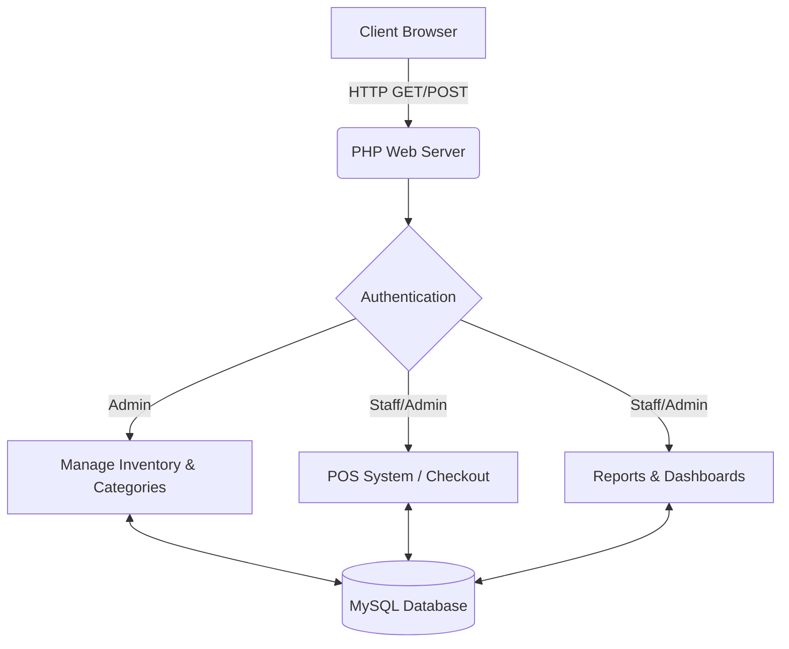

<div align="center">

# 📦 LearnVentory-Hub
**School Cooperative Inventory & POS System**

[](https://www.php.net/)
[](https://www.mysql.com/)
[]()
[](https://opensource.org/licenses/MIT)

<p align="center">
  ระบบจัดการคลังสินค้าและจุดขาย (POS) ผ่านทางเว็บเบราว์เซอร์ 
  ออกแบบมาเฉพาะสำหรับร้านค้าสหกรณ์โรงเรียน มุ่งเน้นไปที่ความรวดเร็ว น่าเชื่อถือ และใช้งานง่าย
</p>

</div>

---

## 📑 สารบัญ (Table of Contents)
- [ภาพรวมของระบบ (Overview)](#-overview)
- [ฟีเจอร์เด่น (Key Features)](#-key-features)
- [สถาปัตยกรรมระบบ (System Architecture)](#-system-architecture)
- [เทคโนโลยีที่ใช้ (Tech Stack)](#-tech-stack)
- [วิธีการติดตั้ง (Getting Started)](#-getting-started)
- [โครงสร้างไฟล์โปรเจกต์ (Project Structure)](#-project-structure)
- [ภาพหน้าจอการทำงาน (Screenshots)](#-screenshots)
- [ผู้จัดทำ (Author)](#-author)

---

## 🎯 ภาพรวมของระบบ (Overview)

**LearnVentory-Hub** มุ่งหวังที่จะนำกระบวนการจัดการสินค้าคงคลังและการคิดเงินของร้านค้าสหกรณ์โรงเรียนเข้าสู่ยุคดิจิทัล โดยเปลี่ยนจากการจดบันทึกลงสมุดแบบเดิม มาเป็นระบบดิจิทัลที่แข็งแกร่ง ช่วยให้ผู้ดูแลระบบและพนักงานสามารถตรวจสอบจำนวนสินค้า จัดการรายการสินค้า และทำการขายได้แบบเรียลไทม์

---

## ✨ ฟีเจอร์เด่น (Key Features)

### 🔐 ความปลอดภัยและการเข้าถึง (Security & Access)
- **Role-Based Authentication (RBAC):** แบ่งสิทธิ์การใช้งานชัดเจนสำหรับ `Admin` (เข้าถึงได้ทุกส่วน) และ `Staff` (สิทธิ์เฉพาะการขาย)
- **Secure Sessions:** รักษาความปลอดภัยในการล็อกอินด้วย Session ใน PHP พร้อมการเข้ารหัสรหัสผ่าน

### 📦 การควบคุมคลังสินค้า (Inventory Control)
- **CRUD Operations:** เพิ่ม (Create), ดู (Read), แก้ไข (Update) และลบ (Delete) สินค้าและหมวดหมู่ได้อย่างราบรื่น
- **Dynamic Filtering:** ค้นหาสินค้าอย่างรวดเร็วด้วยชื่อและตัวกรองหมวดหมู่
- **Low Stock Monitoring:** แสดงผลจำนวนสินค้าคงเหลือแบบเรียลไทม์

### 🛒 ระบบขายหน้าร้าน (Point of Sale - POS)
- **Fast Checkout:** อินเทอร์เฟซการขายที่ใช้งานง่าย ออกแบบมาเพื่อการคิดเงินที่รวดเร็ว
- **Automated Processing:** หักลบจำนวนสินค้าออกจากคลังสินค้าหลักโดยอัตโนมัติเมื่อทำการขาย

### 📊 รายงานทางการขาย (Insights & Reporting)
- **Sales Analytics:** ติดตามประวัติการทำรายการและคำนวณยอดขายรวมได้อย่างแม่นยำ

---

## 🏗️ สถาปัตยกรรมระบบ (System Architecture)



---

## 🛠️ เทคโนโลยีที่ใช้ (Tech Stack)

**เทคโนโลยีฝั่งผู้ใช้งาน (Frontend):**
* **HTML5:** โครงสร้างเว็บมาตรฐานสากล
* **CSS3:** จัดรูปแบบหน้าเว็บรองรับอุปกรณ์ต่างๆ ด้วยดีไซน์ทันสมัย
* **Fonts:** ใช้ฟอนต์ `Sarabun` (Google Fonts) เพื่อความอ่านง่าย สวยงามเหมาะสมกับภาษาไทย

**เทคโนโลยีฝั่งเซิร์ฟเวอร์ (Backend):**
* **PHP:** แกนหลักในการประมวลผล จัดการ Session และการสร้าง Routing
* **MySQL:** ฐานข้อมูลเชิงสัมพันธ์สำหรับการจัดเก็บข้อมูลที่ปลอดภัย
* **Vanilla PHP Extensions:** ใช้ `mysqli` ควบคุมการเข้าถึงฐานข้อมูล

---

## 🚀 วิธีการติดตั้ง (Getting Started)

กระบวนการจำลองเซิร์ฟเวอร์บนเครื่องตัวเอง (Local Development) มีขั้นตอนดังนี้:

### สภาพแวดล้อมที่ต้องการ (Prerequisites)
* โปรแกรมจำลองเซิร์ฟเวอร์เช่น [XAMPP](https://www.apachefriends.org/index.html)
* PHP >= 7.4 (แนะนำ 8.0+)
* MySQL / MariaDB

### วิธีการติดตั้ง (Installation Guide)

1. **คัดลอกไฟล์ลงเซิร์ฟเวอร์จำลอง**
   นำโฟลเดอร์โปรเจกต์ไปวางไว้ในโฟลเดอร์หลักของเซิร์ฟเวอร์:
   - *ตัวอย่างสำหรับ Windows (XAMPP):* `C:\xampp\htdocs\LearnVentory-Hub`

2. **การตั้งค่าฐานข้อมูล (Database Setup)**
   - เปิดโปรแกรม XAMPP Control Panel และกดเริ่ม **Apache** และ **MySQL**
   - พิมพ์ `http://localhost/phpmyadmin` ในช่อง URL ของเบราว์เซอร์
   - สร้างฐานข้อมูลใหม่ขึ้นมาใช้ชื่อว่า `pos_store` (Collation: `utf8mb4_general_ci`)
   - นำเข้า (Import) ไฟล์ชื่อ `pos_store.sql` ที่แถมมากับโปรเจกต์ลงไปในฐานข้อมูลใหม่นี้

3. **รันตัวโปรแกรม (Launch the Application)**
   - เปิดเบราว์เซอร์ไปที่:
     ```text
     http://localhost/LearnVentory-Hub
     ```
   - *หมายเหตุ:* บัญชี Admin เริ่มต้นของระบบ คือ Username: `admin` หรือสามารถสร้างบัญชีแอดมินใหม่เพื่อทดสอบได้ที่หน้า `register.php`

---

## 📂 โครงสร้างไฟล์โปรเจกต์ (Project Structure)

```bash
LearnVentory-Hub/
├── 📄 db.php                  # ไฟล์จัดการการเชื่อมต่อฐานข้อมูล
├── 📄 index.php               # หน้าล็อบบี้ตรวจสอบสิทธิ์ (Entry point)
├── 📄 login.php / logout.php  # จัดการระบบการเข้า-ออกของการล็อกอิน
├── 📄 register.php            # ลงทะเบียนผู้ใช้ใหม่สู่ระบบ
├── 📄 manage_products.php     # [Admin] หน้าเพิ่ม ลด แก้ไข สินค้า
├── 📄 edit_product.php        # ฟอร์มเฉพาะสำหรับการแก้ข้อมูลของสินค้าหลัก
├── 📄 manage_categories.php   # หน้าเพิ่มลบหมวดหมู่ต่างๆ ของคลัง
├── 📄 sell.php                # [Staff/Admin] อินเทอร์เฟซขายสินค้างหน้าร้าน
├── 📄 process_payment.php     # โค้ดตัดสต๊อกและเก็บข้อมูลเมื่อการชำระเงินเสร็จ
├── 📄 sales_report.php        # หน้าดูประวัติและรายงานการขาย
└── 🗄️ pos_store.sql           # ไฟล์ตารางและข้อมูลตั้งต้น
```

---

## 💻 ภาพหน้าจอการทำงาน (Screenshots)

<p align="center">
  
</p>

*การออกแบบที่เน้นความชัดเจน ใช้งานง่าย เหมาะสมในองค์กรโรงเรียน*

---

## 👤 ผู้จัดทำ (Author)


---

